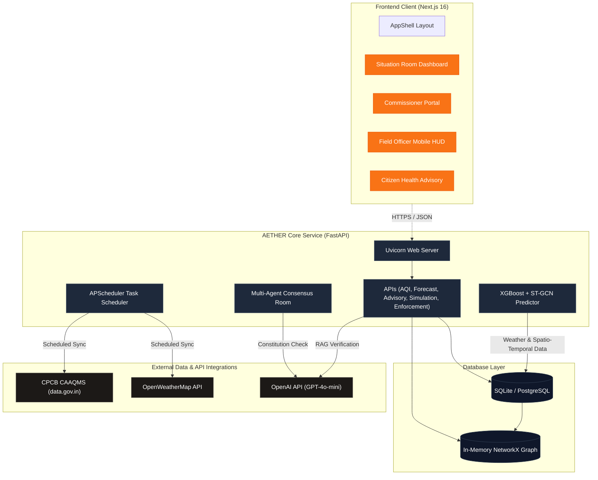
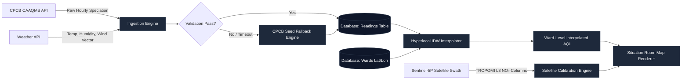
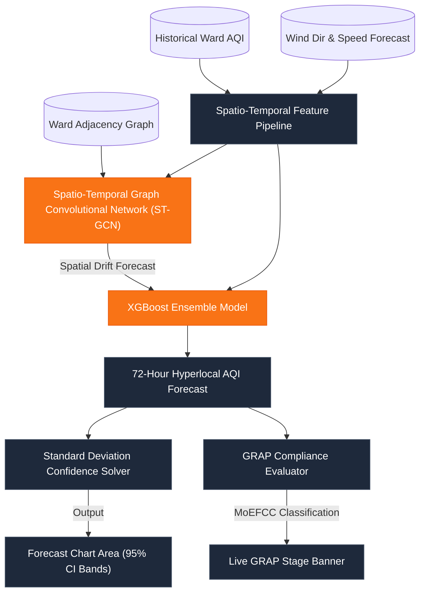
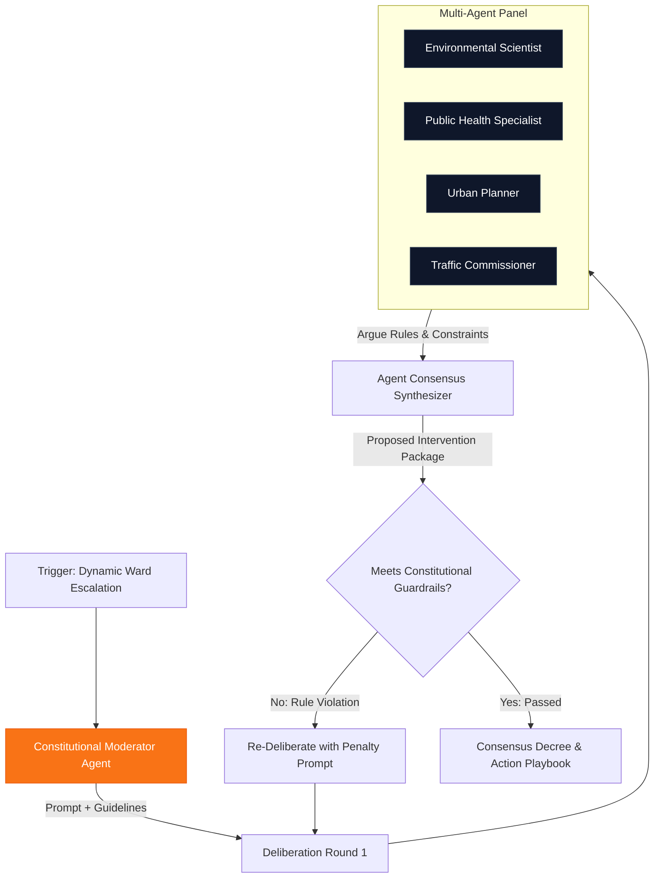
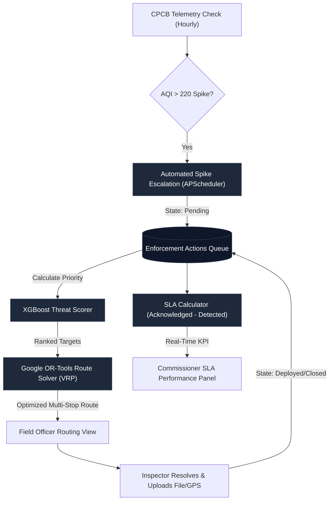

# 🏗️ AETHER — System Architecture & Data Flow

This document details the software architecture, data pipelines, predictive models, and multi-agent system workflows powering the **AETHER Urban Air Quality Intelligence Platform**.

---

## 🗺️ High-Level System Context

AETHER is divided into a microservices layout consisting of an **asynchronous FastAPI backend** (acting as the calculation, machine learning, and data integration engine) and a **Next.js 16 frontend** (serving role-specific dashboards).

---

## 📡 Data Ingestion & Hyperlocal Enrichment

This pipeline illustrates how AETHER fetches ambient air measurements, fills spatial gaps using Inverse Distance Weighting (IDW), and integrates Sentinel-5P satellite columns.

---

## 📈 Hyperlocal Forecasting Model (ST-GCN + XGBoost)

AETHER predicts future air quality by modeling spatial correlations (wind-drift dependencies between wards) using a Graph Convolutional Network, and temporal dependencies using XGBoost.

---

## ⚖️ Multi-Agent Deliberation & Constitutional Intelligence

When a policy simulation is evaluated or an alert triggers, five expert agents deliberate under a Constitutional Moderator to balance public health concerns against economic trade-offs.

---

## 🚨 Automated Enforcement & Intervention SLA

AETHER monitors IoT sensor streams, triggers automated dispatches on anomalies, and calculates municipal response times.

---

## 🛠️ Stack Component Architecture & Databases

| Component Layer | Technology Profile | Architectural Role |
| :--- | :--- | :--- |
| **Frontend Framework** | Next.js 16.2 (App Router) | Static compilation with dynamic hydration; route-specific state management. |
| **Mapping Engine** | Leaflet.js (Dynamic Client Import) | Client-side coordinate mapping, heatmaps, and route overlays. |
| **API Web Server** | FastAPI (Python 3.10+) | Asynchronous ASGI request handling, input schema modeling via Pydantic. |
| **Background Scheduler**| APScheduler | Automated triggers for syncing CPCB data, caching meteorological tables. |
| **Spatial Graph Engine** | NetworkX | In-memory representations of ward adjacency structures. |
| **Route Optimization**  | Google OR-Tools | Formulates and solves Vehicle Routing Problems (VRP) for municipal dispatch. |
| **Legal RAG Engine**    | TF-IDF Vectorizer + Cosine Similarity | Indexes *Air Act 1981* directives for citation mapping. |
| **Database Engine**     | SQLAlchemy ORM + SQLite / PostgreSQL | Dynamic schema generation, index constraints for telemetry readings. |
